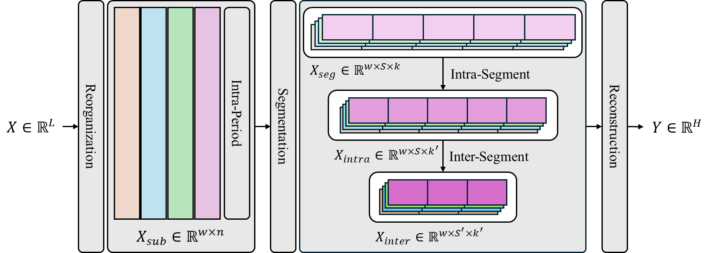
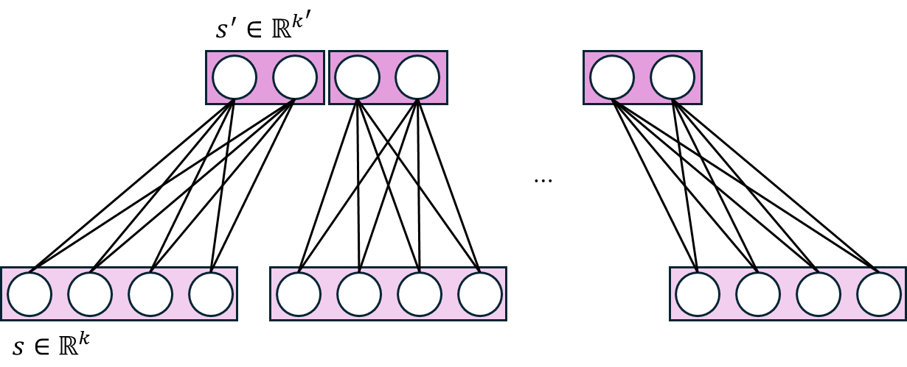

<div align="center">
  <h2>
    <b>SegTSF: Hierarchical Segment Learning For Lightweight Multivariate Time-Series ForeCasting</b>
  </h2>
</div>

<div align="center">

[](https://www.techscience.com/CMES/v147n3/67919)
[](https://doi.org/10.32604/cmes.2026.082506)


</div>

This repository provides the official PyTorch implementation of:

> **SegTSF: Hierarchical Segment Learning For Lightweight Multivariate Time-Series ForeCasting**
> Hyunjun Park, Hee-Gook Jun, Seongyong Kim, and Dong-Hyuk Im
> *Computer Modeling in Engineering & Sciences*, 147(3), 2026.

📄 **Paper:** [Tech Science Press](https://www.techscience.com/CMES/v147n3/67919)
🔗 **DOI:** [10.32604/cmes.2026.082506](https://doi.org/10.32604/cmes.2026.082506)

---

## 🔍 Overview

SegTSF is a lightweight linear model for multivariate time-series forecasting.

Although linear forecasting models are computationally efficient, their limited representational capacity can make it difficult to capture fine-grained local patterns and sudden temporal variations.

SegTSF addresses this limitation through **hierarchical segment learning**:

* **Period-wise reconstruction** reorganizes the input sequence into periodic subsequences.
* **Intra-period learning** captures temporal relationships within each period.
* **Hierarchical segment learning** models local patterns within segments and global relationships across segments.
* **Lightweight linear layers** maintain low parameter and computational costs.

---

## 🏗️ Model Architecture

<p align="center">
  
</p>

SegTSF processes the input sequence through the following steps:

1. Normalize the input using its temporal mean.
2. Aggregate local information through one-dimensional convolution.
3. Reconstruct the sequence into period-level subsequences.
4. Learn temporal relationships within each period.
5. Divide the subsequences into segments.
6. Learn local and global relationships across the segments.
7. Reconstruct and denormalize the final forecast.

The main model is implemented in [`models/SegTSF.py`](./models/SegTSF.py).

---

## 📊 Experimental Results

<p align="center">
  
  
</p>

Detailed numerical results from the paper are provided in:

* [`Figures/Experiments.xlsx`](./Figures/Experiments.xlsx)

---

## 🚀 Getting Started

### 1. Clone the repository

```bash
git clone https://github.com/Pigeon1999/SegTSF.git
cd SegTSF
```

### 2. Create a Conda environment

Create a Conda environment with Python 3.8.20:

```bash
conda create -n segtsf python=3.8.20 -y
```

Activate the environment:

```bash
conda activate segtsf
```

### 3. Install dependencies

```bash
pip install -r requirements.txt
```


---

## 📦 Dataset Preparation

The datasets used in our experiments are publicly available from the following repositories:

* [ETDataset](https://github.com/zhouhaoyi/ETDataset)
* [Time-Series-Library](https://github.com/thuml/Time-Series-Library)

Download the required datasets from the repositories above and create a `Dataset` directory in the project root:

```bash
mkdir Dataset
```

Place the downloaded CSV files in the following directory:

```text
SegTSF/
└── Dataset/
    └── <dataset>.csv
```

The dataset path and filename can be configured in `main.ipynb`.

---

## 📄 Citation

If you find this repository useful in your research, please cite our paper:

```bibtex
@article{park2026segtsf,
  title     = {SegTSF: Hierarchical Segment Learning For Lightweight Multivariate Time-Series ForeCasting},
  author    = {Park, Hyunjun and Jun, Hee-Gook and Kim, Seongyong and Im, Dong-Hyuk},
  journal   = {Computer Modeling in Engineering \& Sciences},
  volume    = {147},
  number    = {3},
  year      = {2026},
  publisher = {Tech Science Press},
  doi       = {10.32604/cmes.2026.082506}
}
```
